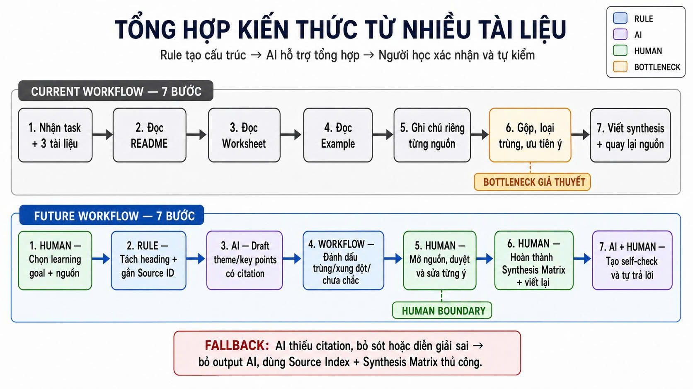

# Group Report — Day 02

## Thành viên nhóm

Bùi Duy Hải  - 2A202601878 - Nhóm trưởng  
Đoàn Nhật Bình  - 2A202602018 - Thành viên  
Phan Bá Khánh Linh  - 2A202601989 - Thành viên  
Lường Duy Thái  - 2A202601021 - Thành viên  
Lê Trung Hiếu  - 2A202601917 - Thành viên  
Lâm Thành Bảo  - 2A202601719 - Thành viên  
Ngô Hoàng Gia Bảo  - 2A202601375 - Thành viên  
Nguyễn Minh Thu  - 2A202601631 - Thành viên  
Nguyễn Hoài Nam  - 2A202601399 - Thành viên  
Đinh Văn Sinh  - 2A202601613 - Thành viên  
Trần Anh Văn  - 2A202601513 - Thành viên  


## Quick validation


| Nguồn | Số người | Tín hiệu xác nhận | Tín hiệu phản bác | Nhóm sửa problem thế nào |
|---|---:|---|---|---|
| Quick interview | 4 | 3/4 sinh viên cho biết phải đọc nhiều PDF/slide và tự ghi chú trước kỳ thi; đều mất nhiều thời gian để tìm ý chính. | 1/4 người cho biết chỉ học từ slide giảng viên nên không thấy quá khó. | Thu hẹp problem thành các môn có nhiều tài liệu (PDF, giáo trình, bài báo) thay vì tất cả các môn học. |
| Mini poll trong lớp | 8 | 6/8 người học gặp khó khăn tổng hợp ý chính từ nhiều tài liệu | 2/8 cho biết tự ghi chú là cách học hiệu quả nên không muốn dùng tóm tắt. | Chỉ tập trung vào trường hợp có từ 3 tài liệu trở lên về cùng một chủ đề, cần hợp nhất các ý trùng lặp, mâu thuẫn và bổ sung lẫn nhau. |


## Research giải pháp

Nhóm tìm các hướng đã có sẵn, không giả định phải tự build từ đầu.

| Nguồn / tool / case | Link | Họ giải quyết phần nào? | Điểm mạnh | Khoảng trống / rủi ro | Bài học cho nhóm |
|---|---|---|---|---|---|
| Google NotebookLM | https://notebooklm.google.com/ | Tổng hợp, tạo study guide và chat với nhiều nguồn tài liệu | Tốt cho việc tìm kiếm chéo (cross-reference) giữa các file | Khó tùy biến luồng trích xuất hoặc tích hợp sâu vào hệ thống học tập cá nhân | Có thể sử dụng Gemini API làm lõi để xử lý phần đọc hiểu và tóm tắt dữ liệu thô |
| ChatPDF | https://www.chatpdf.com/ | Hỏi đáp trực tiếp trên một file PDF tải lên | Giao diện chia đôi màn hình (tài liệu + chat) tiện lợi | Chỉ hoạt động tốt trên từng file đơn lẻ, thiếu khả năng liên kết ngữ nghĩa giữa nhiều tài liệu khác nhau | Cần tích hợp tìm kiếm vector (SBERT) để móc nối các khái niệm liên quan từ nhiều file |
| Notion AI | https://www.notion.so/product/ai | Tóm tắt, viết lại nội dung trực tiếp trong không gian ghi chú | Tốt cho việc tổ chức và lưu trữ kiến thức dài hạn | Không chuyên dụng cho việc xử lý cấu trúc phức tạp của sách/giáo trình định dạng PDF | Bố cục Web (React, Tailwind CSS) cần thiết kế rõ ràng phần lưu trữ (Knowledge Base) sau khi tóm tắt |
| MARK (Machine Assistant with Reliable Knowledge) | https://arxiv.org/abs/2506.23026 | Hệ thống hỏi đáp dựa trên RAG hỗ trợ tra cứu kiến thức học thuật chính xác | Kết hợp tìm kiếm vector (ngữ nghĩa) và từ khóa, có vòng lặp để giảng viên duyệt/chỉnh sửa nội dung | Phụ thuộc vào việc xây dựng sẵn một nguồn dữ liệu (knowledge base) chuẩn xác từ ban đầu | Cần áp dụng chiến lược tìm kiếm lai (hybrid search) để lấy thông tin chuẩn, và nên có cơ chế cho phép người học/giáo viên sửa lại kết quả tóm tắt |

Research takeaway:

```text
Không nên build một công cụ chỉ tóm tắt văn bản đơn thuần vì dễ bị hòa lẫn với các sản phẩm có sẵn. Hướng hợp lý hơn là một luồng quy trình (Workflow) khép kín: 
Người dùng tải tài liệu lên giao diện Web (React, Tailwind) → Backend (FastAPI) phân rã tài liệu → Sử dụng LLM (Gemini API) để tóm tắt và trích xuất ý chính → Dùng mô hình vector (SBERT) để móc nối kiến thức → Cho phép đồng bộ xuống Mobile (Android/SQLite) dưới dạng Flashcard để ôn tập chủ động.
```

## Workflow before/after



## Problem Statement v0

| Field | Nội dung |
|---|---|
| **Actor** | Sinh viên đại học phải đọc nhiều tài liệu (slide, PDF, giáo trình) để học và ôn thi. |
| **Workflow** | Nhận tài liệu từ LMS/Drive → Đọc từng chương → Ghi chú các ý chính → Tổng hợp thành tài liệu ôn tập → Ôn thi. |
| **Bottleneck** | Bước đọc và tự tổng hợp ý chính mất nhiều thời gian vì phải tự xác định nội dung quan trọng từ nhiều tài liệu khác nhau. |
| **Impact** | Mỗi môn học có thể mất 2–4 giờ để đọc và tóm tắt; sinh viên dễ bỏ sót kiến thức hoặc không kịp ôn tập trước kỳ thi. |
| **Success Metric** | Giảm thời gian tổng hợp tài liệu từ 3 giờ xuống dưới 1 giờ; sinh viên vẫn nắm được đầy đủ các ý chính khi ôn tập. |
| **Boundary** | Không tạo thêm kiến thức mới; không thay thế việc học của sinh viên; chỉ hỗ trợ tổng hợp nội dung từ tài liệu được cung cấp. |


## Rule / Workflow / Agent

| Mức | Phương án | Khi nào đủ | Rủi ro | Chọn? |
|---|---|---|---|---|
| **Rule** | Template ghi chú, checklist đọc tài liệu, highlight thủ công | Đủ nếu tài liệu ít và cấu trúc giống nhau | Không tổng hợp được nhiều tài liệu, vẫn phải đọc toàn bộ | Không chọn làm giải pháp chính |
| **Workflow** | Upload PDF → AI tóm tắt → AI trích ý chính → Người học xem và chỉnh sửa | Phù hợp vì workflow tuyến tính, AI hỗ trợ xử lý ngôn ngữ | AI có thể bỏ sót hoặc tóm tắt sai ý quan trọng nên người học cần kiểm tra | Chọn |
| **Agent** | AI tự tìm tài liệu, đọc nhiều nguồn, tạo tài liệu ôn tập hoàn chỉnh | Chỉ cần nếu phải lấy dữ liệu từ nhiều hệ thống khác nhau | Khó kiểm soát nguồn, dễ sinh thông tin sai | Chưa chọn |


## Problem Statement v1

| Field | Nội dung |
|---|---|
| **Actor** | Sinh viên đại học phải đọc nhiều tài liệu (PDF, slide, giáo trình) để học và ôn thi. |
| **Workflow** | Nhận tài liệu → Đọc PDF/slide → Ghi chú → Tổng hợp ý chính → Ôn tập. |
| **Bottleneck** | Đọc và tổng hợp ý chính từ nhiều tài liệu mất nhiều thời gian; khó xác định nội dung quan trọng. |
| **Impact** | Mất khoảng 2–4 giờ/môn để tổng hợp tài liệu; dễ bỏ sót kiến thức và giảm hiệu quả ôn thi. |
| **Success Metric** | Giảm thời gian tổng hợp từ 3 giờ xuống dưới 1 giờ; người học vẫn nắm được đầy đủ các ý chính. |
| **Boundary** | AI không tự tạo kiến thức mới, không thay người học quyết định nội dung ôn tập; chỉ xử lý tài liệu được cung cấp. |
| **AI intervention point** | Sau khi người học tải tài liệu lên, trước bước tự ghi chú và tổng hợp. |
| **Mức chọn** | Workflow: người học upload tài liệu → AI tóm tắt, trích ý chính → người học kiểm tra và chỉnh sửa. |
| **Rủi ro & người thật kiểm tra** | AI có thể bỏ sót ý quan trọng hoặc tóm tắt sai ngữ cảnh. Người học phải đọc lại và xác nhận trước khi sử dụng để ôn tập. |
